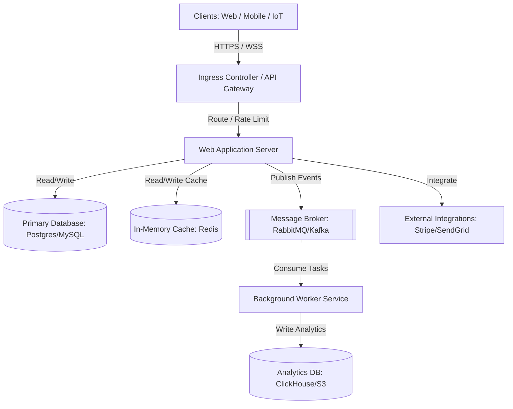

# System Overview & Architecture Topology (system-overview.md)

This document maps the architectural topology, core runtime environments, data flow diagrams, and physical/logical system constraints for this project. It serves as the primary Source of Truth (SoT) for understanding system boundaries.

---

## 1. Architectural Topology

The system is structured as a decoupled, multi-tiered service layer. The diagram below illustrates the typical flow of requests through the ingress gateway down to internal databases and external API integrations.

---

## 2. Core Runtime Environments

This repository runs across the following standardized deployment tiers:

| Environment | Host Platform | Operating System | Purpose | Access Restrictions |
| :--- | :--- | :--- | :--- | :--- |
| **Development** | Local Machine (Docker) | Local Linux/macOS | Code creation & unit testing | Developer local scope |
| **Staging** | Kubernetes Cluster (EKS/GKE) | Alpine Linux | Integration and QA validation | VPN Protected |
| **Production** | Auto-Scaling Kubernetes | Alpine Linux | User traffic serving | Multi-factor Auth (MFA) & IAM |

---

## 3. Data Flow & Communication Map

### Standard Request/Response Lifecycle:
1.  **Ingress & TLS Termination**: Request is intercepted at the edge gateway. TLS is terminated, and standard rate-limiting controls are checked.
2.  **Authentication & Authorization**: The request JWT or API Key is verified against the Identity provider.
3.  **Application Logic & DB Fetch**: The web application server executes domain rules and fetches database entities, utilizing the Redis cache to prevent database load where possible.
4.  **Async Task Dispatch**: Heavy CPU tasks or third-party operations (e.g., invoice generation, email dispatch) are published to the message broker and executed out-of-band by background workers.
5.  **Clean Output Delivery**: Response payload is filtered for sensitive fields (anti-PII leak) and returned to the client with correct HTTP status semantics.

---

## 4. System Constraints & Guardrails

The workspace operates under the following hard boundaries:

*   **Request Payload Size Limit**: Max payload size of `10MB` is enforced at the Ingress controller.
*   **Database Connection Limits**: Primary pool size must not exceed `50` active connections per application node.
*   **Max Request Timeouts**: Edge gateway terminates connection after `30 seconds` for synchronous calls. Any long-lived tasks must utilize asynchronous job workflows.
*   **Rate Limits**: Default of `100` requests per IP address per minute for standard endpoints, and `10` requests per minute for login/registration endpoints.
